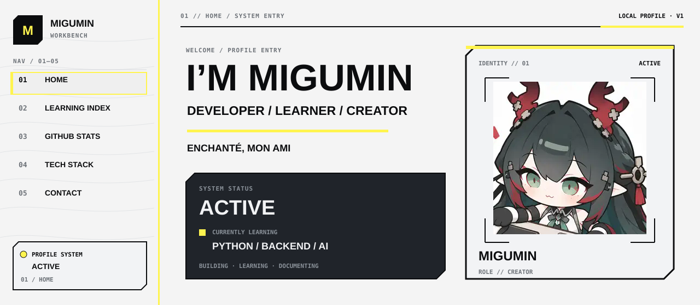
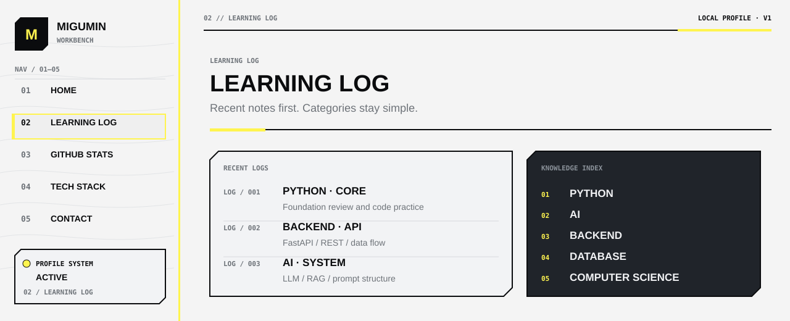
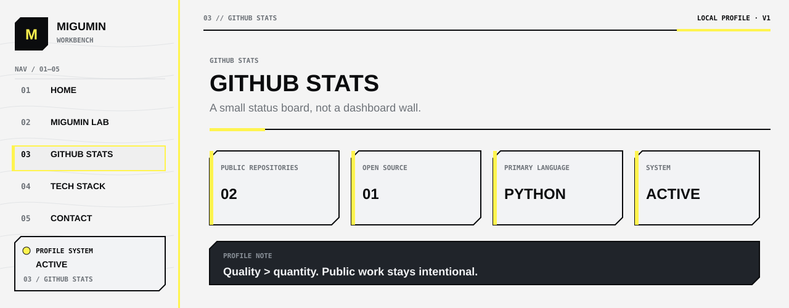
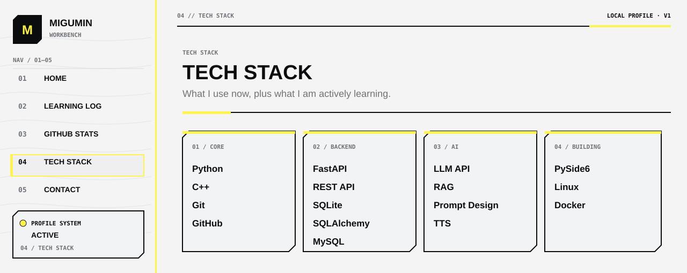
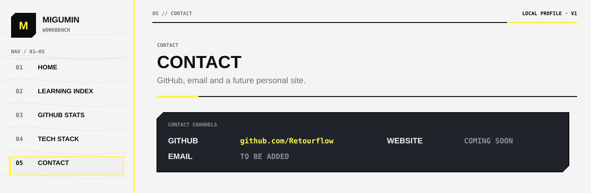

  

  <code>PYTHON</code> · <code>AI</code> · <code>BACKEND</code> · <code>DATABASE</code> · <code>COMPUTER SCIENCE</code>

  <a href="https://github.com/Retourflow">GITHUB</a> ·
  EMAIL // TO BE ADDED ·
  WEBSITE // COMING SOON

