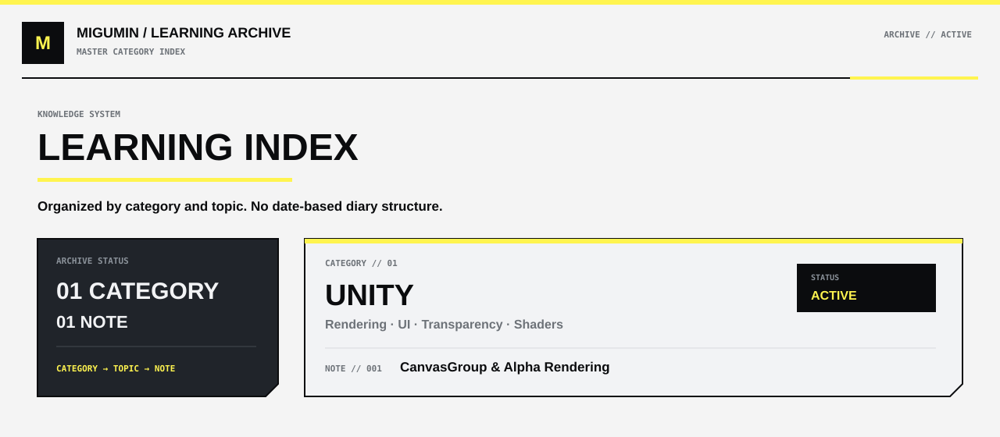

  

  <a href="./unity/README.md"><b>01 // UNITY</b></a>

### 01 // UNITY

**AREA**  
Rendering / UI

**NOTES**
- [CanvasGroup 与透明渲染](./unity/canvasgroup-alpha-rendering.md)

**KEYWORDS**  
`CanvasGroup` · `Alpha Blending` · `Render Order` · `RenderTexture` · `Transparency Sorting` · `Spine` · `Live2D` · `Dissolve` · `Dither Fade`

---

  <a href="../README.md">← PROFILE HOME</a>

